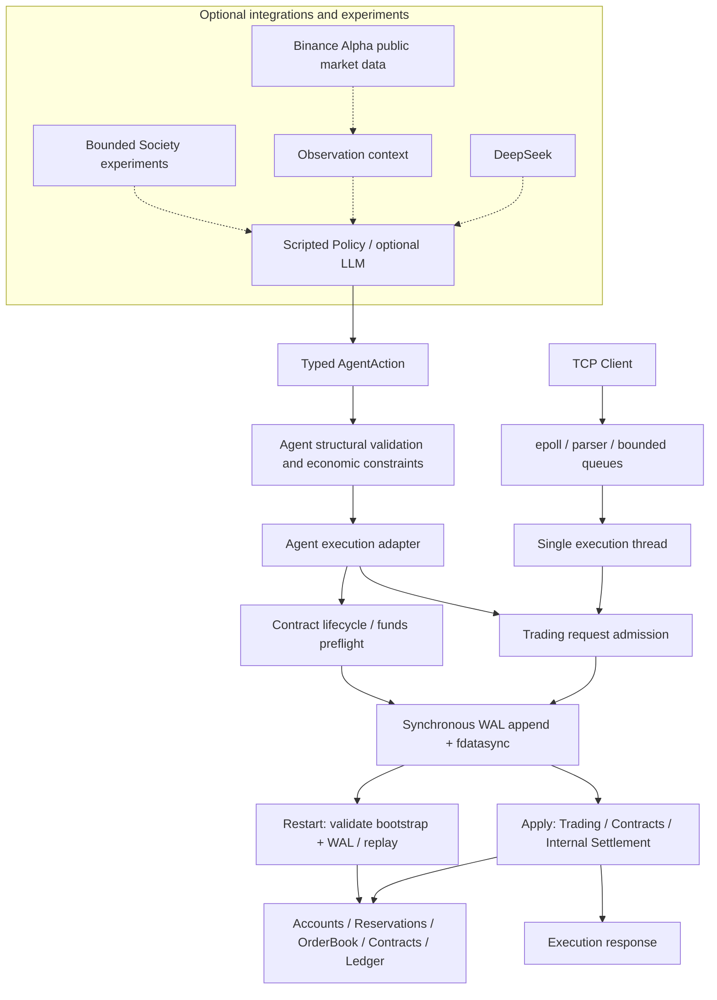

# Deterministic Agent Execution Runtime

[简体中文](README.md) | English

> This is the English version of `README.md`. If the two versions differ, the Chinese README is authoritative.

A deterministic C++20 execution runtime that converts probabilistic or scripted Agent intent into typed actions, applies structural validation and economic constraints, and then executes internal exchange trading, durable bilateral contracts, and internal settlement. The system uses exact integer accounting, a synchronous WAL, and crash recovery to reconstruct orders, balances, reservations, contracts, and the Ledger.

**Agents may propose actions, but they cannot directly mutate authoritative financial state through the Agent interface.** Model output is advisory; the runtime determines admission, execution order, and economic consequences. This is a systems engineering and portfolio project.

## Core Guarantees

- **Explicit execution order**: The TCP gateway uses epoll for concurrent I/O, bounded command and response queues, and a single execution thread. AgentRuntime executes turns sequentially. Both reuse the trading execution boundary. Callers that compose the runtime directly are responsible for serializing calls; the interface does not support arbitrary concurrent writes.
- **Typed Agent boundary**: Actions pass through structural validation and configured hard economic constraints before an adapter forwards them to the executors. Policies cannot write accounts, matching state, or the Ledger directly.
- **Exact trading and accounting**: Prices, quantities, and asset balances use integers and checked conversions. Account-backed orders use price-time priority; buy orders reserve quote, sell orders reserve base, and cancellation verifies ownership before releasing the remaining reservation.
- **Internal contract settlement**: The runtime validates lifecycle state, participants, and available funds, transfers internal quote through the existing execution path, and records Ledger settlement metadata.
- **WAL-before-apply**: A durable runtime synchronously journals a command before applying it to authoritative state. Trading and contract commands share the WAL sequence.
- **Deterministic recovery and explicit failure**: The same bootstrap and a valid WAL reconstruct economic state. Recovery validates the configuration fingerprint, record version, checksum, and sequence. It truncates an incomplete trailing record and refuses to start when a complete record is corrupted. Journal failures or unexpected apply failures poison the runtime.

These guarantees are covered by the [trading execution tests](tests/execution/trading_request_executor_test.cpp), [durable Agent tests](tests/agent/exchange/durable_agent_execution_test.cpp), [durable contract tests](tests/durability/durable_contract_execution_test.cpp), and [recovery tests](tests/durability/execution_recovery_test.cpp). Non-durable construction paths remain available for tests and benchmarks; the primary demo and server described here use the durable runtime.

## Architecture and Trust Boundary



Agent economic constraints belong to the AgentRuntime turn pipeline. TCP trading requests use account-aware trading admission and business validation; they do not automatically receive Agent profile constraints. Contracts are currently executed through the Agent or direct runtime interfaces, while the TCP protocol supports trading requests only.

## Demo A: Deterministic Local Demo

[exchange_runtime_demo](apps/exchange_runtime_demo/main.cpp) uses production execution paths, fixed scripted actions, and a real temporary WAL. It requires no external APIs, model credentials, or internet access. The program checks its result at each stage, exits with failure if an expectation is violated, and removes the temporary WAL when it finishes.

| Demo stage | Observable result and invariant |
| --- | --- |
| 1. Valid typed trading actions | Two Agents submit a sell order and a buy order, producing a trade, a remaining resting order, a reservation, and Ledger entries. |
| 2. Invalid intent rejection | A buy price exceeds the existing `max_buy_price` constraint; accounts, orders, reservations, the Ledger, and the WAL remain unchanged. |
| 3. Durable contract lifecycle + internal settlement | `Proposed → Accepted → Fulfilled → Settled`; the demo shows both identities, the ContractId, obligations, the quote transfer, and Ledger metadata. |
| 4. Ambiguous crash window | After the child process completes a command through the durable executor, the parent sends `SIGKILL` before delivery of the business response. The WAL contains the command, but the application did not receive a success response. |
| 5. Process restart + recovery | A fresh runtime is created from the same bootstrap and WAL, then verifies the recovered orders, balances, reservations, contract, and Ledger. No Agent decision memory is restored. |
| 6. Explicit retry semantics | Submitting the same RequestId again creates a new order and demonstrates ID continuity after recovery. Retrying an already settled contract returns `InvalidTransition` and does not pay twice. |

Output excerpt:

```text
Result: EconomicConstraintRejected reason=BuyPriceExceeded
Authoritative state unchanged: true
Lifecycle: Proposed -> Accepted -> Fulfilled -> Settled
Business response delivered: false
Process terminated with SIGKILL.
Exact expected state recovered: true
Repeated request_id=40 result=Accepted new_order_id=4
Settlement retry: contract_id=1 result=InvalidTransition
```

## Build and Run

The demo and epoll server target Linux / WSL2 and require a C++20 compiler and CMake 3.20+. The minimal build explicitly disables the optional providers that are enabled by default, so their dependencies are not required:

```bash
cmake -S . -B build -DCMAKE_BUILD_TYPE=Release \
  -DEXCHANGE_BUILD_DEEPSEEK_PROVIDER=OFF \
  -DEXCHANGE_BUILD_BINANCE_ALPHA_FEED=OFF
cmake --build build -j
./build/exchange_runtime_demo
ctest --test-dir build --output-on-failure
```

Tests are enabled by default. If GoogleTest is not installed, CMake downloads v1.15.2, so the first configuration may require network access. Once built, the demo and default tests do not access external services.

The standalone trading server uses the existing fixed bootstrap. Choose an available port and a writable WAL path:

```bash
./build/exchange_server 9000 ./build/server.wal
```

The server does not provide production-grade authentication or account-management APIs. Demo A composes the runtime directly so it can show contracts and state queries that the TCP protocol does not expose.

## Durability, Recovery, and Failure Semantics

Durable execution follows this order:

```text
validate / admit → append WAL → fdatasync → apply authoritative state → respond
```

Admission is not equivalent to every business decision. Agent structural or economic-constraint rejections never reach the executor. Contract lifecycle checks and settlement funds validation complete before the WAL write. Some trading business rejections, such as insufficient funds, are returned during apply after journaling; recovery still replays the record and its allocated execution identity. It is therefore incorrect to interpret every rejection as “no WAL record.”

If a command is durable but the process crashes before sending its response, the client observes an **ambiguous response**. On restart, a matching bootstrap and a valid WAL prefix reconstruct authoritative economic state and execution sequences. The Ledger is regenerated by applying commands; recovery neither calls the model nor reconstructs its reasoning. Recovery accepts and truncates an incomplete trailing record, but explicitly fails on complete-record corruption, sequence errors, or configuration mismatches.

- **There is no RequestId deduplication or exactly-once guarantee**: RequestId correlates an operation only, and a retry may create a new order.
- Contract lifecycle rules reject a retry after completed settlement with `InvalidTransition`, preventing another transfer. This is not general-purpose request deduplication.
- A journal failure or an unexpected apply inconsistency after durability poisons the shared runtime and causes subsequent execution to fail. The system does not claim transactional rollback for arbitrary exceptions.

The real process boundary is verified by the [server crash tests](tests/gateway/durable_server_process_test.cpp) and [contract crash tests](tests/durability/durable_contract_process_test.cpp), including unread responses, crash/restart behavior, and subsequent ID continuity.

## Internal Settlement

Settlement uses the **internal quote balance**. A payment obligation follows this path:

```text
PaymentObligation → lifecycle / participant / funds validation → synchronous WAL
→ available quote transfer → ContractState::Settled + obligation completion
→ Ledger settlement metadata → recoverable from WAL
```

Settlement spends available quote only; it does not release or consume order reservations. Ledger metadata links the contract with the payer and payee accounts. This is not fiat, USDT, wallet, blockchain, or x402 settlement. Completion of a `ComputeCredit` obligation also does not represent delivery of real compute resources.

## Test Strategy

The default tests cover system boundaries:

| Boundary | Primary coverage |
| --- | --- |
| Matching / accounting | Price-time priority, partial fills, cancellation, ownership, reservations, exact amounts, and the Ledger. |
| Execution | Stable business results, admission, ID and logical-time allocation, and exception propagation. |
| WAL / recovery | Encoding and decoding, synchronization before apply, corruption and torn-tail handling, bootstrap consistency, and state reconstruction. |
| Contracts / settlement | Lifecycle, participant authorization, funds validation, internal transfers, prevention of repeated settlement, and recovery of mixed trading and contract histories. |
| Agent runtime | Typed actions, structural and economic constraints, sequential visibility, rejection before execution, and a fake feed. |
| Providers (when enabled) | JSON/action and market-data parsing, metadata, snapshots, and stale state using fake or captured data. |
| Networking / process | epoll framing, response routing, bounded-queue backpressure, and real process crash/restart behavior. |

The test count varies with the provider configuration; use the current `ctest` result as the source of truth. Performance measurements use the separate benchmark targets below. Live smoke applications require explicit opt-in and are not part of the default tests.

## Performance Measurement

The repository provides three targets. Historical numbers without comparable build and machine records are intentionally omitted:

| Target | Timed scope |
| --- | --- |
| `exchange_benchmark` | Google Benchmark measures OrderBook operations or command replay through MatchingEngine with event generation. It excludes workload preparation, instance initialization and capacity reservation, and cleanup. It does not include account settlement, TCP, or the WAL. `EndToEndReplay` means matching replay, not the full durable runtime path. |
| `exchange_gateway_benchmark` | Throughput and latency measure loopback TCP request/response processing, including parsing, queues, account execution, matching, the Ledger, and client-side response handling. Durable mode additionally includes per-command `fdatasync`. Startup, connection establishment, workload preparation, warmup, and end-of-phase validation are excluded. Pressure scenarios use separate timing scopes. |
| `exchange_recovery_benchmark` | Measures startup recovery through the production `TradingRuntime::create_durable` path. WAL generation, post-recovery validation, and the ID probe are excluded. RSS is an approximation of current resident memory, not a process-isolated peak. |

Building benchmarks requires an installed Google Benchmark CMake package:

```bash
cmake -S . -B build-bench -DCMAKE_BUILD_TYPE=Release \
  -DEXCHANGE_BUILD_TESTS=OFF -DEXCHANGE_BUILD_BENCHMARKS=ON \
  -DEXCHANGE_BUILD_DEEPSEEK_PROVIDER=OFF \
  -DEXCHANGE_BUILD_BINANCE_ALPHA_FEED=OFF
cmake --build build-bench --target exchange_benchmark \
  exchange_gateway_benchmark exchange_recovery_benchmark -j
./build-bench/exchange_benchmark
./build-bench/exchange_gateway_benchmark --help
./build-bench/exchange_recovery_benchmark 1000
```

Comparisons should retain the compiler, Release configuration, machine and storage, workload, client concurrency, and durability mode. Non-durable throughput is not a substitute for durable throughput.

## Optional Agent Integrations

The AgentRuntime turn pipeline is observation → provider intent → typed action → structural validation → economic constraints → execution adapter → result and metrics. The primary demo uses a fixed scripted provider. The optional DeepSeek provider parses JSON responses into the existing action space. Model output always remains advisory intent.

- **DeepSeek**: `EXCHANGE_BUILD_DEEPSEEK_PROVIDER`; requires libcurl and nlohmann-json.
- **Binance Alpha**: `EXCHANGE_BUILD_BINANCE_ALPHA_FEED`; additionally requires OpenSSL and Boost headers. The single 哈基米 symbol is resolved from Alpha public metadata. Market data is observation context only, and the feed does not fabricate a price before it receives valid data or when the data is stale. It does not mutate accounts, settle assets, or send Binance orders.
- Both provider build options default to ON, but they do not call services automatically. `EXCHANGE_BUILD_AGENT_LIVE_SMOKE=ON` builds `exchange_agent_live_smoke`; it requires both providers and accesses real services at runtime, independently of the offline primary demo.

### Experimental Multi-Agent Layer

`EXCHANGE_BUILD_AGENT_SOCIETY_SMOKE=ON` builds the optional `exchange_agent_society_smoke`. It combines bounded turns, sequential observation visibility, initial (genesis) balances and configuration, internal trading, contract settlement, and utility/metrics. The current CLI limits runs to 1–30 steps.

`--market none` disables external market data, but this smoke application still uses DeepSeek, and its build still requires both providers. `ComputeCredit` is a synthetic resource description with no production or consumption resource model. Interaction may be sparse, and a valid HOLD is also an experimental result. This project makes no claim of real emergence or a long-running autonomous society. Society remains parked for later research and does not drive the stable runtime baseline.

## Repository Navigation and Scope

- `include/` and `src/`: `matching` for matching; `accounting` for accounts, reservations, and the Ledger; `execution` for admission and the runtime; `durability` for the WAL and recovery; `gateway` and `protocol` for the networking boundary; `agent` for the typed domain, turns, and optional providers; and `replay` for matching workloads and replay.
- `apps/`: the primary demo, TCP server, and opt-in live/Society applications.
- `tests/`: unit, integration, and process-level boundary tests.
- `benchmarks/`: matching, gateway, and recovery measurements.

The current scope is single-node, one instrument per runtime, serialized authoritative execution, internal balances, a synchronous WAL, deterministic recovery, and bounded Agent experiments.

Non-goals include production exchange deployment, distributed consensus or HA, snapshots or compaction, a generalized Agent OS, wallets or custody, on-chain or x402 settlement, a marketplace, reputation, credit or lending, generalized negotiation, and real Binance trading.
