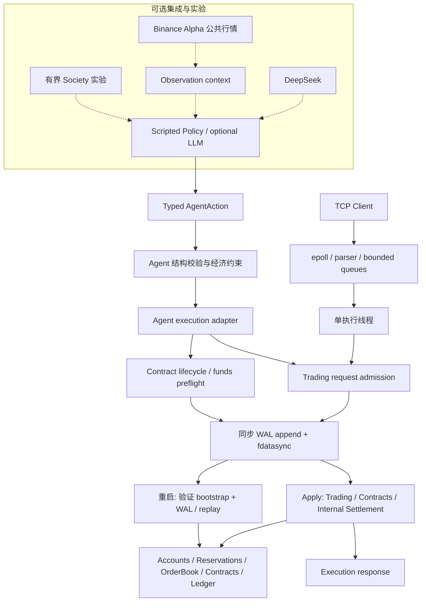

# Deterministic Agent Execution Runtime

简体中文 | [English](README-EN.md)

一个 C++20 确定性执行 runtime：将概率性或脚本化的 Agent 意图转换为 typed action，经结构校验与经济约束后执行内部交易、持久化双边合约和内部结算。系统使用精确整数记账、同步 WAL 与崩溃恢复，重建订单、余额、预留、合约和 Ledger。

**Agent 可以提出动作，但不能通过 Agent 接口直接修改权威财务状态。** 模型输出是建议；准入、执行顺序与经济后果由 runtime 决定。项目面向系统工程学习与作品展示。

## Core Guarantees

- **显式执行顺序**：TCP gateway 使用 epoll 并发 I/O、有界命令/响应队列和单执行线程；AgentRuntime 顺序执行回合。二者复用交易执行边界，直接组合 runtime 的调用者负责串行调用，接口不提供任意并发写入保证。
- **Typed Agent 边界**：动作先经过结构校验和配置的硬经济约束，再通过 adapter 进入执行器；策略不能直接写账户、撮合或 Ledger。
- **精确交易与记账**：价格、数量与资产余额使用整数及受检换算；账户支持的订单按价格/时间优先撮合，买单预留 quote、卖单预留 base，撤单验证所有权并释放剩余预留。
- **内部合约结算**：验证生命周期、参与方与可用资金，通过现有执行路径转移内部 quote，并记录 Ledger settlement metadata。
- **WAL-before-apply**：durable runtime 同步 journal 后才应用权威状态；交易和合约命令共享 WAL 顺序。
- **确定性恢复与显式失败**：相同 bootstrap 与有效 WAL 重建经济状态；校验配置指纹、记录版本、校验和与序列。截断不完整尾记录，完整记录损坏则拒绝启动；journal 或意外 apply 失败会 poison runtime。

保证由 [交易执行测试](tests/execution/trading_request_executor_test.cpp)、[Agent 耐久测试](tests/agent/exchange/durable_agent_execution_test.cpp)、[合约耐久测试](tests/durability/durable_contract_execution_test.cpp) 和 [恢复测试](tests/durability/execution_recovery_test.cpp) 覆盖。非持久化构造路径仍用于测试与基准；本页主 demo 和 server 使用 durable runtime。

## 架构与信任边界



Agent 经济约束属于 AgentRuntime 的回合流程；TCP 交易请求使用账户感知的交易准入与业务校验，不自动获得 Agent profile 约束。合约目前通过 Agent/direct runtime 接口执行，TCP 协议仅支持交易请求。

## Demo A：本地确定性演示

[exchange_runtime_demo](apps/exchange_runtime_demo/main.cpp) 使用真实生产执行路径、固定脚本动作和真实临时 WAL，不需要外部 API、模型密钥或互联网。程序逐阶段检查结果，不满足预期即失败退出；结束时清理临时 WAL。

| 演示阶段 | 可观察结果与不变量 |
| --- | --- |
| 1. Valid typed trading actions | 两个 Agent 提交卖单/买单，产生成交、剩余挂单、预留及 Ledger。 |
| 2. Invalid intent rejection | 买价超过现有 `max_buy_price` 约束；账户、订单、预留、Ledger 和 WAL 保持不变。 |
| 3. Durable contract lifecycle + internal settlement | `Proposed → Accepted → Fulfilled → Settled`；显示双方身份、ContractId、义务、quote 转账和 Ledger metadata。 |
| 4. Ambiguous crash window | 子进程通过 durable executor 完成命令后，父进程在业务响应交付前发送 `SIGKILL`；WAL 已有命令，应用未收到成功响应。 |
| 5. Process restart + recovery | 用相同 bootstrap/WAL 创建全新 runtime，核对恢复的订单、余额、预留、合约与 Ledger；无需恢复 Agent 决策内存。 |
| 6. Explicit retry semantics | 相同 RequestId 再次提交产生新订单，展示恢复后的 ID 连续性；已结算合约重试返回 `InvalidTransition`，不重复付款。 |

输出节选：

```text
Result: EconomicConstraintRejected reason=BuyPriceExceeded
Authoritative state unchanged: true
Lifecycle: Proposed -> Accepted -> Fulfilled -> Settled
Business response delivered: false
Process terminated with SIGKILL.
Exact expected state recovered: true
Repeated request_id=40 result=Accepted new_order_id=4
Settlement retry: contract_id=1 result=InvalidTransition
```

## 构建与运行

Demo 和 epoll server 面向 Linux / WSL2，需要 C++20 编译器、CMake 3.20+。最小构建显式关闭默认开启的可选 provider，避免要求其依赖：

```bash
cmake -S . -B build -DCMAKE_BUILD_TYPE=Release \
  -DEXCHANGE_BUILD_DEEPSEEK_PROVIDER=OFF \
  -DEXCHANGE_BUILD_BINANCE_ALPHA_FEED=OFF
cmake --build build -j
./build/exchange_runtime_demo
ctest --test-dir build --output-on-failure
```

测试默认开启：若未安装 GoogleTest，CMake 会下载 v1.15.2，因此首次配置可能需要网络；构建后的 demo 与默认测试不访问外部服务。

独立交易服务器使用已有固定 bootstrap；选择空闲端口和可写 WAL 路径：

```bash
./build/exchange_server 9000 ./build/server.wal
```

服务器不提供生产级认证或账户管理接口。Demo A 直接组合 runtime，以展示 TCP 协议尚未暴露的合约和状态查询。

## 耐久性、恢复与失败语义

Durable 执行的顺序为：

```text
validate / admit → append WAL → fdatasync → apply authoritative state → respond
```

准入与所有业务判定并不等价：Agent 结构/经济约束拒绝不进入执行器；合约生命周期和结算资金校验在 WAL 前完成；部分交易业务拒绝（例如资金不足）在 journal 后的 apply 中返回，记录与分配的执行身份仍由恢复重放。不能将所有 rejection 都解释为“没有 WAL 记录”。

若命令已持久化但进程在响应前崩溃，客户端结果是**不确定**的。重启使用匹配的 bootstrap 和有效 WAL 前缀重建权威经济状态及执行序列，Ledger 由命令应用重新生成；不调用模型或重建其思考过程。恢复接受不完整末尾记录并截断该尾部，对完整记录的损坏、序列错误或配置不匹配明确失败。

- **没有 RequestId 去重或 exactly-once 保证**：RequestId 只用于关联操作，重复提交可能产生新的订单。
- 已完成结算的合约受生命周期约束，重试返回 `InvalidTransition`，不会再次转账；这不是通用请求去重。
- journal 失败或 durable 后意外 apply 不一致会 poison 共享 runtime，后续执行失败；不声称任意异常都具有事务回滚能力。

真实进程边界由 [server crash tests](tests/gateway/durable_server_process_test.cpp) 和 [contract crash tests](tests/durability/durable_contract_process_test.cpp) 验证，包括未读取响应、崩溃重启和后续 ID 延续。

## 内部结算

结算使用**内部 quote 余额**。支付义务的执行流程是：

```text
PaymentObligation → 生命周期/参与方/资金校验 → 同步 WAL
→ available quote 转账 → ContractState::Settled + 义务完成
→ Ledger settlement metadata → 可从 WAL 重建
```

结算只花费可用 quote，不释放或挪用订单预留。Ledger metadata 关联合约与付款/收款账户。这里不涉及法币、USDT、钱包、区块链或 x402 结算；`ComputeCredit` 义务完成也不代表真实计算资源交付。

## 测试策略

默认测试按系统边界覆盖：

| 边界 | 主要验证内容 |
| --- | --- |
| Matching / accounting | 价格时间优先、部分成交、撤单、所有权、预留、精确金额及 Ledger。 |
| Execution | 稳定业务结果、准入、ID/逻辑时间分配、异常传播。 |
| WAL / recovery | 编解码、同步先于 apply、损坏/尾部截断、bootstrap 一致性和状态重建。 |
| Contracts / settlement | 生命周期、参与方权限、资金检查、内部转账、不重复结算及混合交易/合约恢复。 |
| Agent runtime | Typed action、结构与经济约束、顺序可见性、拒绝不进入执行及 fake feed。 |
| Providers（启用时） | JSON/action 和行情解析、元数据、快照与 stale 状态；使用 fake/captured 数据。 |
| Networking / process | epoll framing、响应路由、有界队列背压，以及真实进程崩溃与重启。 |

测试数量随 provider 配置变化，以当前 `ctest` 结果为准。性能测量使用下面的独立 benchmark targets；live smoke 是显式启用的应用，不属于默认测试。

## 性能测量

仓库提供三个目标，当前不展示缺少可比构建/机器记录的历史数字：

| Target | 计时范围 |
| --- | --- |
| `exchange_benchmark` | Google Benchmark：OrderBook 操作，或 MatchingEngine + 事件生成的 command replay。排除 workload 准备、实例初始化/容量预留及清理；不包含账户结算、TCP 或 WAL。`EndToEndReplay` 指撮合 replay，不是 durable runtime 全链路。 |
| `exchange_gateway_benchmark` | Throughput/latency：loopback TCP 请求到响应处理，包含 parser、队列、账户执行、撮合、Ledger 和客户端响应处理；durable 模式另包含逐命令 `fdatasync`。排除启动、连接、workload 准备、warmup 及阶段结束校验；压力场景有单独计时范围。 |
| `exchange_recovery_benchmark` | 生产 `TradingRuntime::create_durable` 的启动恢复时间；排除 WAL 生成、恢复后校验和 ID probe。RSS 是当前驻留内存近似值，不是独立进程峰值。 |

启用 benchmark 需要已安装 Google Benchmark CMake package：

```bash
cmake -S . -B build-bench -DCMAKE_BUILD_TYPE=Release \
  -DEXCHANGE_BUILD_TESTS=OFF -DEXCHANGE_BUILD_BENCHMARKS=ON \
  -DEXCHANGE_BUILD_DEEPSEEK_PROVIDER=OFF \
  -DEXCHANGE_BUILD_BINANCE_ALPHA_FEED=OFF
cmake --build build-bench --target exchange_benchmark \
  exchange_gateway_benchmark exchange_recovery_benchmark -j
./build-bench/exchange_benchmark
./build-bench/exchange_gateway_benchmark --help
./build-bench/exchange_recovery_benchmark 1000
```

比较结果时应保留编译器、Release 配置、机器/存储、workload、客户端并发及 durability 模式；非持久化吞吐量不能代替 durable 吞吐量。

## 可选 Agent 集成

AgentRuntime 的回合流程是 observation → provider intent → typed action → 结构校验 → 经济约束 → execution adapter → 结果/指标。主 demo 使用固定脚本 provider；可选 DeepSeek provider 将 JSON 响应解析为现有动作空间。模型输出始终是 advisory intent。

- **DeepSeek**：`EXCHANGE_BUILD_DEEPSEEK_PROVIDER`，需要 libcurl 和 nlohmann-json。
- **Binance Alpha**：`EXCHANGE_BUILD_BINANCE_ALPHA_FEED`，另外需要 OpenSSL 与 Boost headers。单个哈基米 symbol 由 Alpha 公共元数据解析；行情仅作为 observation context，未收到有效数据或 stale 时不制造价格。feed 不改账户、不结算资产、不发送 Binance 订单。
- 两个 provider 构建选项默认 ON，但不自动调用服务。`EXCHANGE_BUILD_AGENT_LIVE_SMOKE=ON` 才构建 `exchange_agent_live_smoke`；它需要两个 provider，运行时访问真实服务，独立于离线主 demo。

### Experimental Multi-Agent Layer

`EXCHANGE_BUILD_AGENT_SOCIETY_SMOKE=ON` 构建可选 `exchange_agent_society_smoke`。它组合有界回合、顺序观察可见性、初始（genesis）余额/配置、内部交易、合约结算与 utility/metrics；当前 CLI 将步数限制在 1–30。

`--market none` 可关闭外部行情，但该 smoke 仍使用 DeepSeek，构建也仍要求两个 provider。`ComputeCredit` 是合成资源描述，没有生产/消费资源模型；交互可以稀疏，合法 HOLD 也是实验结果。这里不声称真实涌现或长期自治社会。Society 已作为后续研究保留，不驱动当前 runtime 的稳定基线。

## 仓库导航与范围

- `include/`、`src/`：`matching` 撮合；`accounting` 账户/预留/Ledger；`execution` 准入与 runtime；`durability` WAL/恢复；`gateway`/`protocol` 网络边界；`agent` typed domain、回合和可选 provider；`replay` 撮合 workload/replay。
- `apps/`：主 demo、TCP server，以及 opt-in live/Society 应用。
- `tests/`：单元、集成和进程级边界验证。
- `benchmarks/`：撮合、gateway 和恢复测量。

当前范围是单节点、每个 runtime 一个 instrument、串行权威执行、内部余额、同步 WAL、确定性恢复与有界 Agent 实验。

非目标包括生产交易所部署、分布式共识/HA、snapshot/compaction、通用 Agent OS、钱包/托管、链上或 x402 结算、marketplace、reputation、信贷、通用谈判和真实 Binance 交易。
